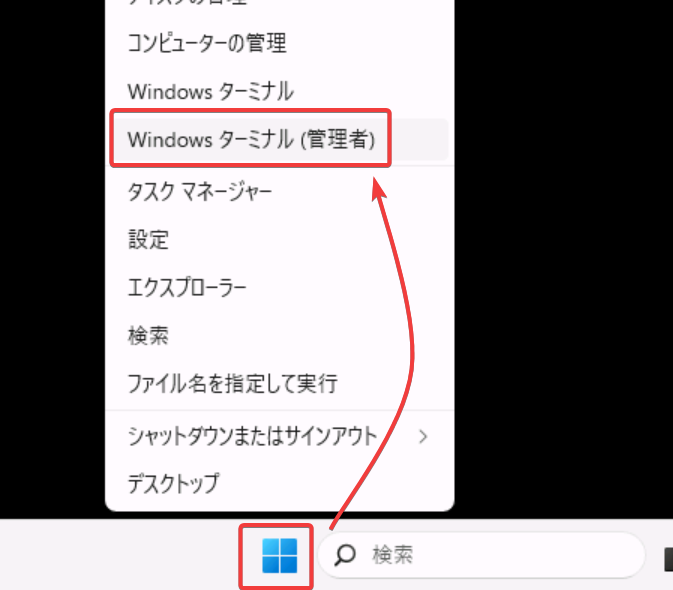
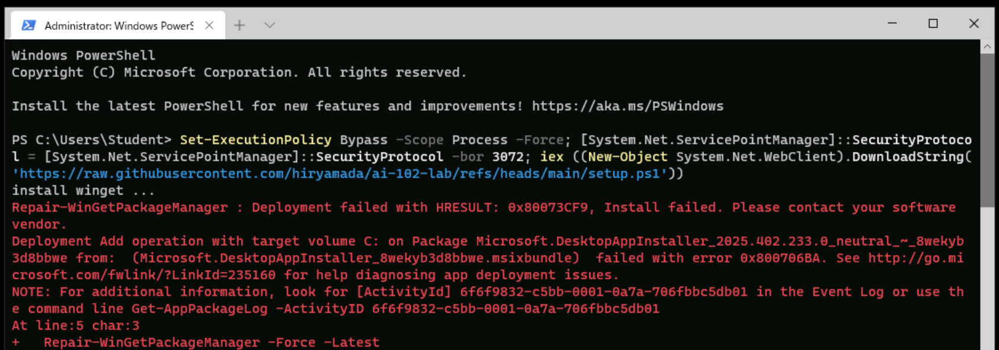

- ラボ内部のWindowsスタートボタンを右クリックし「Windows ターミナル(管理者)」をクリック
- 
- 「このアプリがデバイスに変更を加えることを許可しますか？」→「はい」
- 以下のテキストをコピーし、ターミナルに貼り付けてエンター

```pwsh
Set-ExecutionPolicy Bypass -Scope Process -Force; [System.Net.ServicePointManager]::SecurityProtocol = [System.Net.ServicePointManager]::SecurityProtocol -bor 3072; iex ((New-Object System.Net.WebClient).DownloadString('https://raw.githubusercontent.com/hiryamada/ai-102-lab/refs/heads/main/setup.ps1'))
```

- もし途中で以下のようなエラーが表示された場合は、再度テキストをコピーし、ターミナルに貼り付けてエンターしてください。
- 
- 問題がなければ、セットアップが進行します。操作はせずに、そのまま5分ほどお待ち下さい。
- セットアップが完了すると、Visual Studio Codeが開きます。
- Visual Studio Codeが開いたら、`steps.dib` を開きます。（開くのに少し時間がかかります）
- `steps.dib` が表示されたら、中のセルをそれぞれ順番に実行します。


